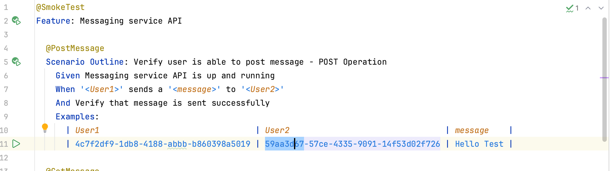

## BDD-Cucumber Framework
The repo consists of Messaging service API automated tests using Rest Assured

## Instructions to run the tests
1. Java and maven should be installed on your machine
2. Clone the repo
2. Navigate to the repository in a terminal and run the following commands, in order: mvn clean install
3. Create 2 users and Pass the UserID 1,User ID2 and Message in the smokeTest.feature file (line no: 11) as shown in the screenshot below:

4. Run the command to execute test: mvn -Dtest=runner test
5. Open the html report (target/cucumber.html) in browser to verify the results

## Observations/Issues identified
1. Post Message service - request Body accepts User ID and message value as blank. It should be mandatory field

2. Response code 500 is returned when wrong request body is passed. Expected value is 400 Bad request
